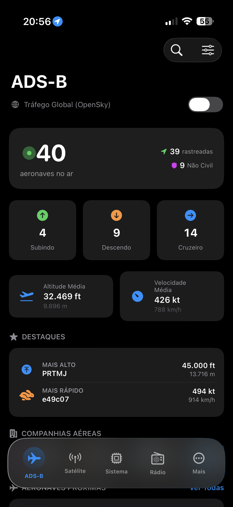
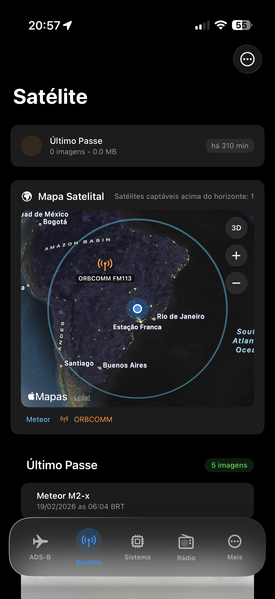
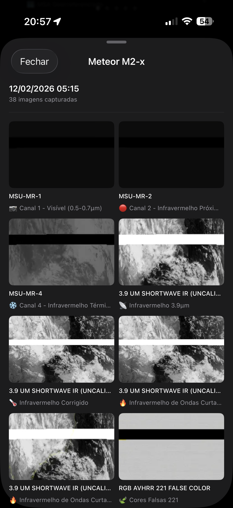
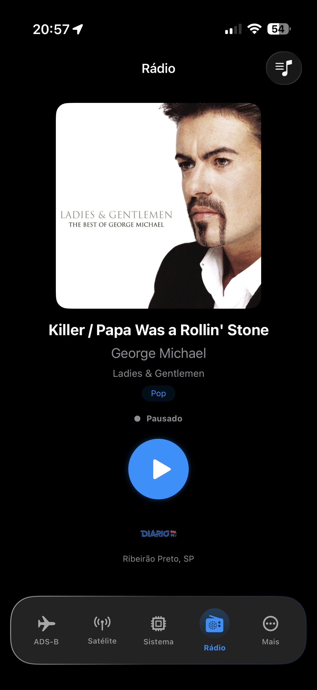
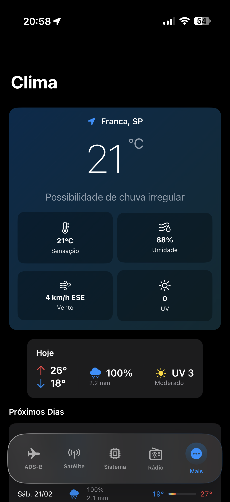
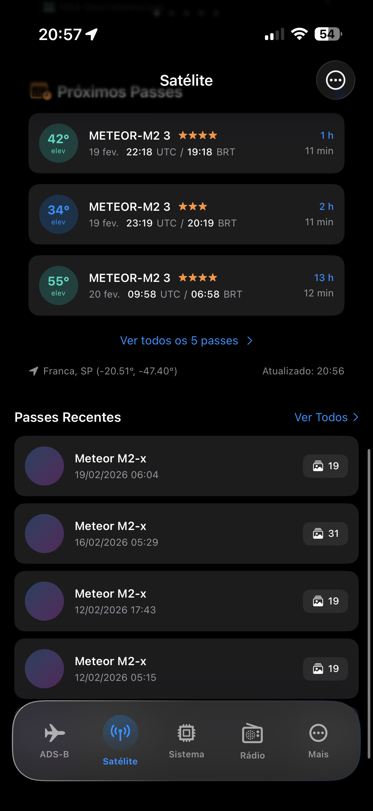
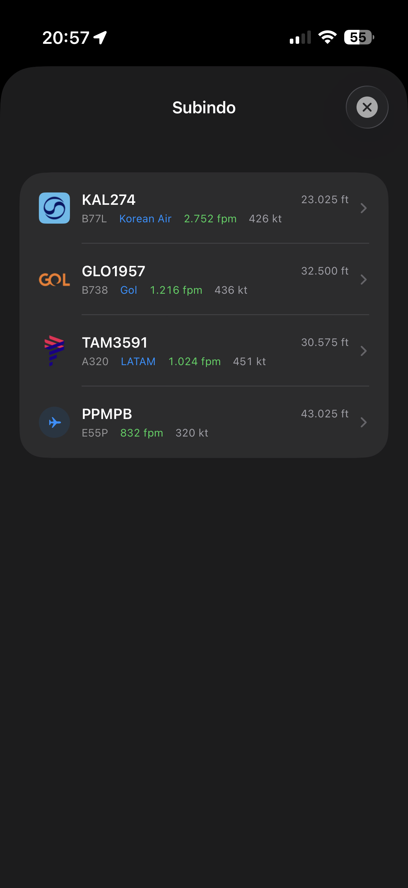
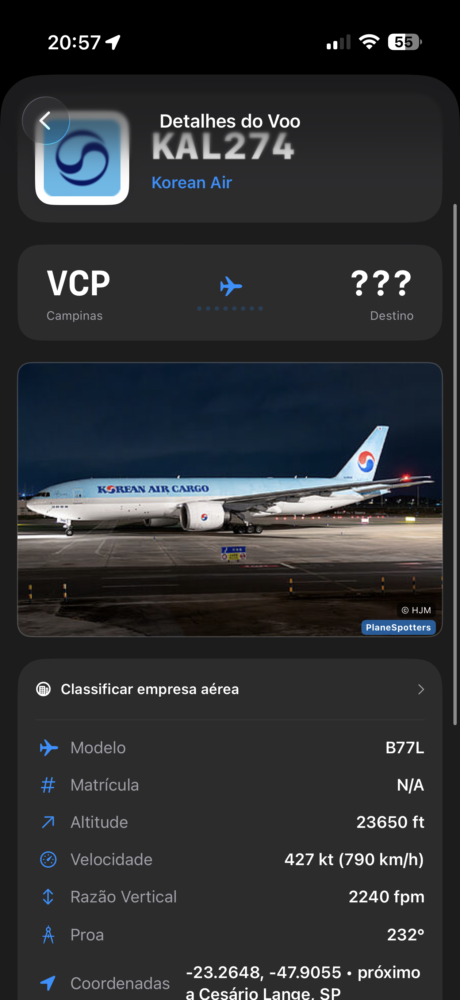
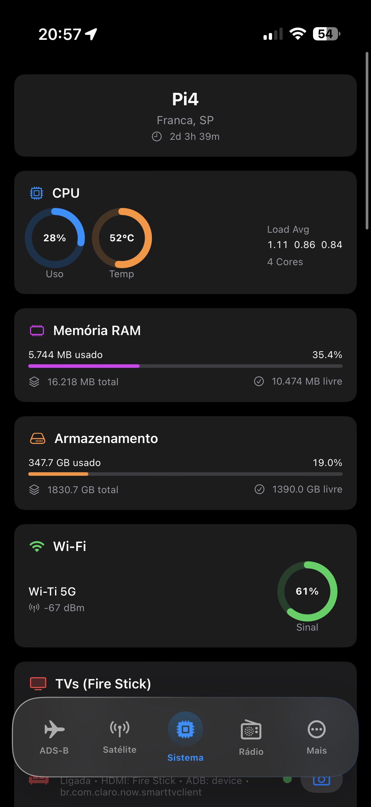
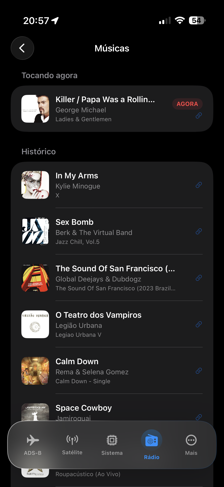

# MeuLab App

App SwiftUI para iOS/iPadOS que monitora em tempo real os serviços do ambiente MeuLab (ADS-B, ACARS, satélite, sistema, rádio e clima).

## Visão geral

- Tabs principais: `ADS-B`, `Radar`, `ACARS`, `Satélite`, `Sistema`, `Rádio` e `Clima`
- Dados vindos de `https://app.meulab.fun` e feed de aeronaves próximas via `https://voa.meulab.fun`
- Suporte a push notifications com navegação automática para a aba relacionada ao alerta
- Token de API carregado em runtime (sem segredo hardcoded no código)

## Screenshots

### Visão principal das abas

| | | |
|---|---|---|
| <br><sub>ADS-B: total de aeronaves, distribuição por fase de voo, altitude/velocidade média e destaques.</sub> | <br><sub>Mapa satelital com cobertura da estação, satélites captáveis e resumo do último passe.</sub> | <br><sub>Status do Pi4 com CPU, temperatura, RAM, armazenamento e sinal Wi‑Fi.</sub> |
| <br><sub>Player da rádio com capa, faixa atual, status de reprodução e controle central.</sub> | <br><sub>Clima atual em Franca/SP com sensação, umidade, vento, UV e previsão do dia.</sub> | <br><sub>Lista de próximos passes Meteor M2-3 e histórico recente de capturas.</sub> |

### Fluxos detalhados

| | | |
|---|---|---|
| <br><sub>Modal de aeronaves subindo com callsign, companhia, razão vertical, velocidade e altitude.</sub> | <br><sub>Detalhe do voo com origem/destino, foto da aeronave e telemetria completa.</sub> | <br><sub>Grade de imagens por canal/espectro (visível, infravermelho e composições).</sub> |
| <br><sub>Biblioteca de músicas: “tocando agora” + histórico de faixas com deep links.</sub> |  |  |

## Requisitos

- Xcode 15+
- iOS/iPadOS 17+
- Swift 5.9+

## Setup rápido

1. Abra `MeuLabApp.xcodeproj` no Xcode.
2. Crie `MeuLabApp/Resources/Secrets.plist` com base em `MeuLabApp/Resources/Secrets.plist.example`.
3. Preencha o token:

```xml
<key>API_TOKEN</key>
<string>SEU_TOKEN_AQUI</string>
```

4. Em `Signing & Capabilities`, configure seu Team.
5. Rode no simulador ou dispositivo (`⌘R`).

## Configuração de segredos

O app busca o token nesta ordem:

1. `Info.plist` (`API_TOKEN`)
2. `Secrets.plist` no bundle (`API_TOKEN`)

Se não houver token, endpoints protegidos retornam `401`.

## Arquitetura (código atual)

- `MeuLabApp/MeuLabApp.swift`: bootstrap do app e integração com notificações
- `MeuLabApp/ContentView.swift`: `TabView` principal e roteamento entre abas
- `MeuLabApp/Services/APIService.swift`: cliente HTTP e mapeamento de endpoints
- `MeuLabApp/Services/PushNotificationManager.swift`: permissões APNs, token e categorias
- `MeuLabApp/Services/AudioPlayer.swift`: player de rádio
- `MeuLabApp/Services/LocationManager.swift`: localização para funcionalidades de mapa/alertas
- `MeuLabApp/ViewModels/AppState.swift`: estado compartilhado da aplicação
- `MeuLabApp/Views/Tabs/*.swift`: telas funcionais por domínio

## Endpoints usados pelo app

| Endpoint | Uso |
|---|---|
| `/api/adsb/summary` | resumo ADS-B |
| `/api/adsb/aircraft` | lista de aeronaves |
| `/api/acars/summary` | resumo ACARS |
| `/api/acars/messages` | últimas mensagens ACARS |
| `/api/acars/hourly` | estatísticas horárias ACARS |
| `/api/acars/search` | busca de mensagens ACARS |
| `/api/system/status` | status do sistema |
| `/api/radio/now-playing` | música/programa atual |
| `/api/weather/current` | clima atual |
| `/api/satdump/last/images` | últimas imagens de satélite |
| `/api/satdump/passes` | passes de satélite |
| `/api/satdump/image` | imagem individual de satélite |
| `/notifications/register` | registro de token push |
| `/notifications/unregister` | remoção de token push |

## Push notifications

Para habilitar ponta a ponta:

1. Ative `Push Notifications` e `Background Modes > remote-notification` no target.
2. Configure APNs no Apple Developer.
3. Garanta que o backend aceite `register/unregister` com token válido.

## Licença

Uso pessoal - MeuLab.fun.
