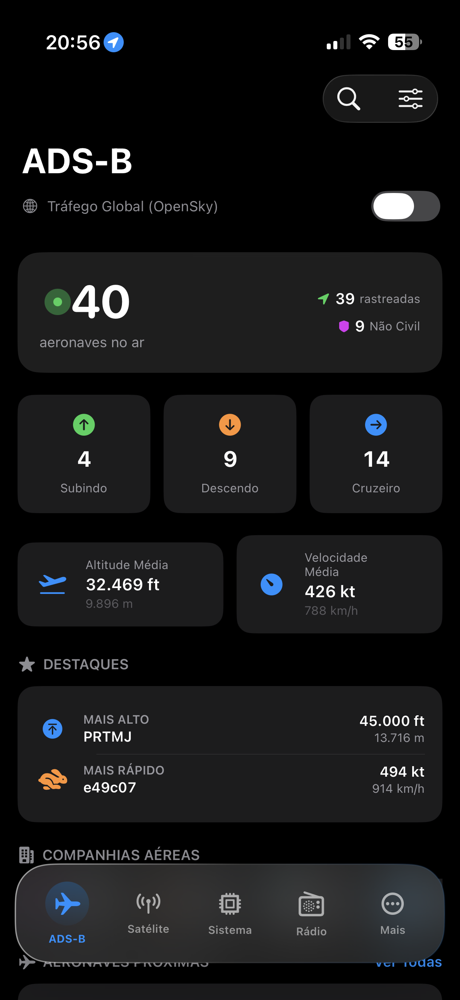
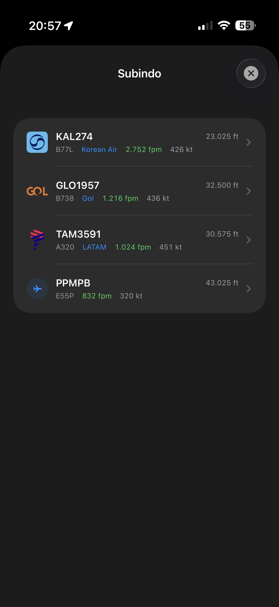
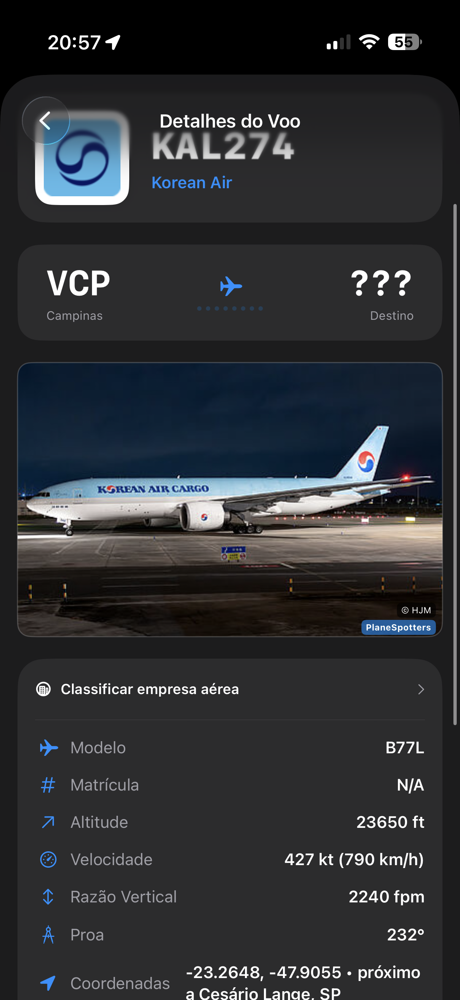
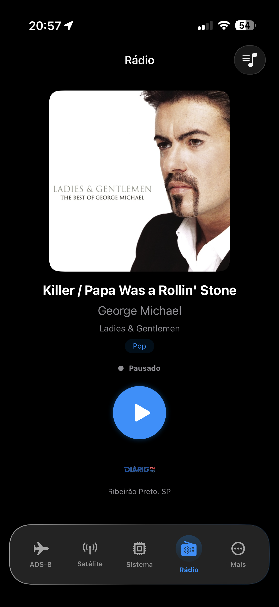
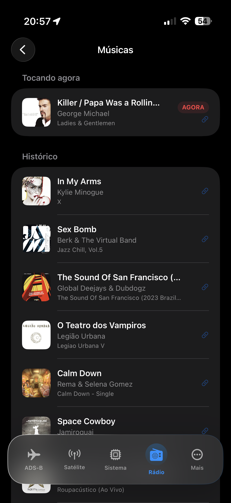
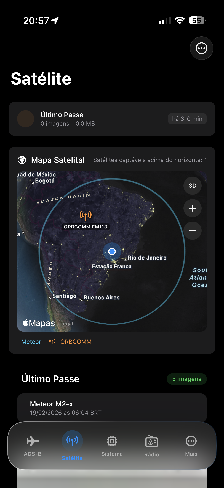
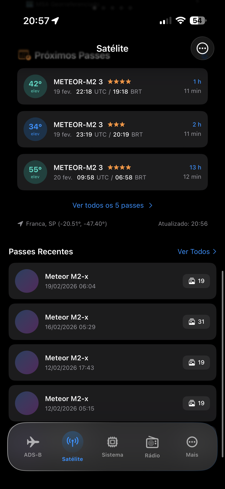
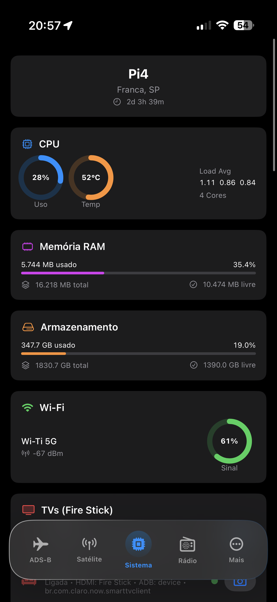
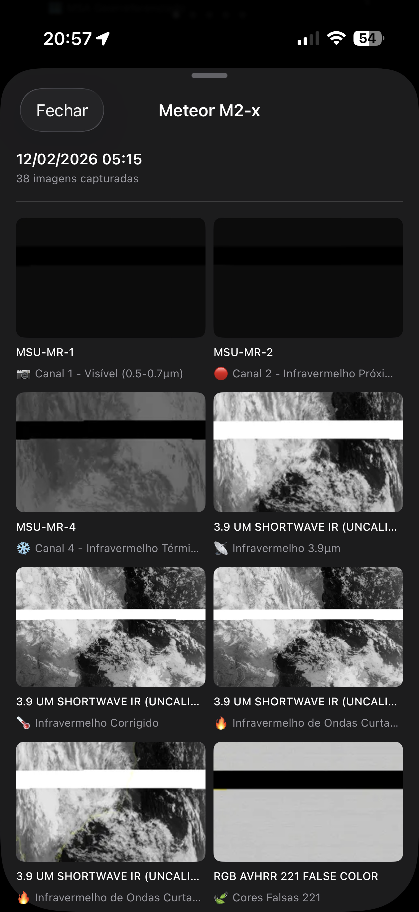
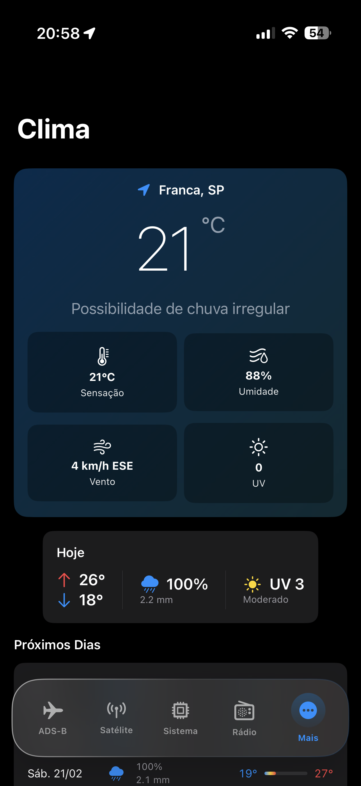

# MeuLab App

## English

SwiftUI app for iOS and iPadOS that monitors MeuLab services in real time.

## Screenshots / Capturas de tela

<table>
  <tr>
    <td align="center">
      <br>
      <sub>ADS-B overview / Visão geral do ADS-B</sub>
    </td>
    <td align="center">
      <br>
      <sub>Climbing aircraft list / Lista de aeronaves em subida</sub>
    </td>
  </tr>
  <tr>
    <td align="center">
      <br>
      <sub>Flight details / Detalhes do voo</sub>
    </td>
    <td align="center">
      <br>
      <sub>Now playing / Tocando agora</sub>
    </td>
  </tr>
  <tr>
    <td align="center">
      <br>
      <sub>Radio history / Histórico da rádio</sub>
    </td>
    <td align="center">
      <br>
      <sub>Satellite map / Mapa de satélite</sub>
    </td>
  </tr>
  <tr>
    <td align="center">
      <br>
      <sub>Satellite passes / Passagens de satélite</sub>
    </td>
    <td align="center">
      <br>
      <sub>Pass gallery / Galeria de passagens</sub>
    </td>
  </tr>
  <tr>
    <td align="center">
      <br>
      <sub>System overview / Visão geral do sistema</sub>
    </td>
    <td align="center">
      <br>
      <sub>Weather overview / Visão geral do clima</sub>
    </td>
  </tr>
</table>

### Overview

The app is designed as a client for the MeuLab environment, aggregating operational data from aviation, satellite, system, radio, and weather services into a single mobile interface.

Main areas:

- ADS-B
- Radar
- ACARS
- Satellite
- System
- Radio
- Weather

### Features

- real-time MeuLab service monitoring
- push notifications with automatic tab routing
- API token loaded at runtime instead of hardcoded in source
- iPhone and iPad support with SwiftUI

### Requirements

- Xcode 15+
- iOS / iPadOS 17+
- Swift 5.9+

### Quick Start

1. Open `MeuLabApp.xcodeproj` in Xcode.
2. Create `MeuLabApp/Resources/Secrets.plist` from `Secrets.plist.example`.
3. Add your `API_TOKEN`.
4. Configure your development team in Signing & Capabilities.
5. Run on a simulator or device.

Example:

```xml
<key>API_TOKEN</key>
<string>YOUR_TOKEN_HERE</string>
```

### Secret Loading

The app looks for the token in this order:

1. `Info.plist` via `API_TOKEN`
2. `Secrets.plist` bundled with the app via `API_TOKEN`

If no token is found, protected endpoints return `401`.

### Architecture

- `MeuLabApp/MeuLabApp.swift`: app bootstrap and notification integration
- `MeuLabApp/ContentView.swift`: main tab container
- `MeuLabApp/Services/APIService.swift`: HTTP client and endpoint integration
- `MeuLabApp/Services/PushNotificationManager.swift`: APNs registration and handling
- `MeuLabApp/Services/AudioPlayer.swift`: radio playback
- `MeuLabApp/Services/LocationManager.swift`: location-aware features
- `MeuLabApp/ViewModels/AppState.swift`: shared app state
- `MeuLabApp/Views/Tabs/*.swift`: feature-specific screens

### Main Endpoints

- `/api/adsb/summary`
- `/api/adsb/aircraft`
- `/api/acars/summary`
- `/api/acars/messages`
- `/api/acars/hourly`
- `/api/acars/search`
- `/api/system/status`
- `/api/radio/now-playing`
- `/api/weather/current`
- `/api/satdump/last/images`
- `/api/satdump/passes`
- `/api/satdump/image`
- `/notifications/register`
- `/notifications/unregister`

### Push Notifications

To enable the full notification flow:

1. enable `Push Notifications`
2. enable `Background Modes > remote-notification`
3. configure APNs in Apple Developer
4. make sure the backend accepts registration and unregistration with a valid token

### License

Personal MeuLab use.

## Português

App SwiftUI para iPhone e iPad que monitora os serviços do ambiente MeuLab em tempo real.

### Visão Geral

O app funciona como cliente do ambiente MeuLab, reunindo dados operacionais de aviação, satélite, sistema, rádio e clima em uma única interface móvel.

Áreas principais:

- ADS-B
- Radar
- ACARS
- Satélite
- Sistema
- Rádio
- Clima

### Funcionalidades

- monitoramento em tempo real dos serviços do MeuLab
- push notifications com navegação automática para a aba relacionada
- token de API carregado em runtime, sem segredo hardcoded no código
- suporte a iPhone e iPad com SwiftUI

### Requisitos

- Xcode 15+
- iOS / iPadOS 17+
- Swift 5.9+

### Início Rápido

1. Abra `MeuLabApp.xcodeproj` no Xcode.
2. Crie `MeuLabApp/Resources/Secrets.plist` a partir de `Secrets.plist.example`.
3. Adicione seu `API_TOKEN`.
4. Configure seu time de desenvolvimento em Signing & Capabilities.
5. Rode no simulador ou dispositivo.

Exemplo:

```xml
<key>API_TOKEN</key>
<string>SEU_TOKEN_AQUI</string>
```

### Carregamento de Segredos

O app procura o token nesta ordem:

1. `Info.plist` com a chave `API_TOKEN`
2. `Secrets.plist` no bundle com a chave `API_TOKEN`

Se não houver token, endpoints protegidos retornam `401`.

### Arquitetura

- `MeuLabApp/MeuLabApp.swift`: bootstrap do app e integração com notificações
- `MeuLabApp/ContentView.swift`: contêiner principal de abas
- `MeuLabApp/Services/APIService.swift`: cliente HTTP e integração com endpoints
- `MeuLabApp/Services/PushNotificationManager.swift`: registro e tratamento de APNs
- `MeuLabApp/Services/AudioPlayer.swift`: reprodução da rádio
- `MeuLabApp/Services/LocationManager.swift`: recursos dependentes de localização
- `MeuLabApp/ViewModels/AppState.swift`: estado compartilhado do app
- `MeuLabApp/Views/Tabs/*.swift`: telas específicas de cada domínio

### Principais Endpoints

- `/api/adsb/summary`
- `/api/adsb/aircraft`
- `/api/acars/summary`
- `/api/acars/messages`
- `/api/acars/hourly`
- `/api/acars/search`
- `/api/system/status`
- `/api/radio/now-playing`
- `/api/weather/current`
- `/api/satdump/last/images`
- `/api/satdump/passes`
- `/api/satdump/image`
- `/notifications/register`
- `/notifications/unregister`

### Push Notifications

Para habilitar o fluxo completo:

1. ative `Push Notifications`
2. ative `Background Modes > remote-notification`
3. configure APNs no Apple Developer
4. garanta que o backend aceite registro e remoção com token válido

### Licença

Uso pessoal do MeuLab.
